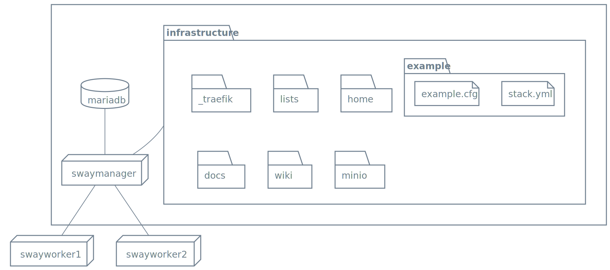

# Deployment Docs



## Prereqs

### Configure namecheap
- Add wildcard to the main ip

### Configure NFS

1. turn on `sudo systemctl enable systemd-networkd-wait-online.service`
2. disable ipv6

### Configure Mariadb
1. After installation and setting up admin user change bind address:

```python
# sudo vim mariadb.conf.d/50-server.cnf
bind-address	= 0.0.0.0:
```


### Practices
- prefer docker commands over config files

### Release Schedule

1.  on thursday 10am automaatically pause all merge request to preview branch
1.  then automatically run all load and e2e tests